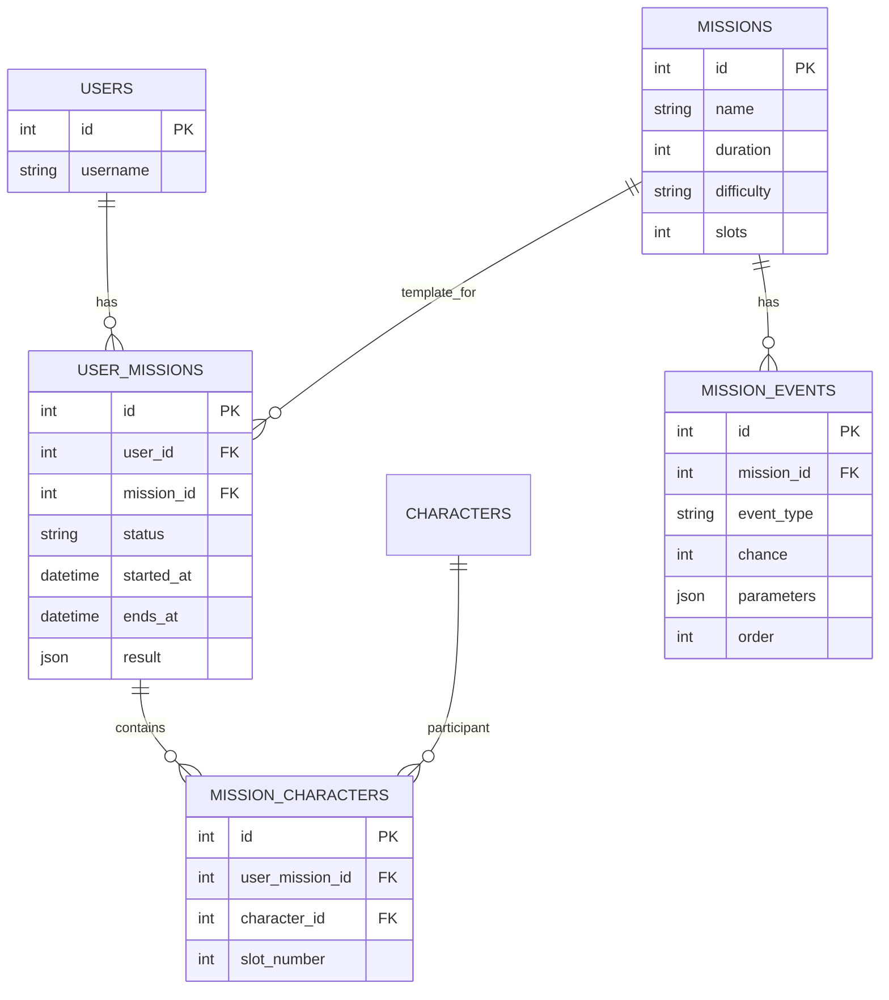

```mermaid
erDiagram
    USERS ||--o{ USER_MISSIONS : has
    MISSIONS ||--o{ USER_MISSIONS : template_for
    USER_MISSIONS ||--o{ MISSION_CHARACTERS : contains
    CHARACTERS ||--o{ MISSION_CHARACTERS : participant
    MISSIONS ||--o{ MISSION_EVENTS : has

    USERS {
      int id PK
      string username
    }
    MISSIONS {
      int id PK
      string name
      int duration
      string difficulty
      int slots
    }
    MISSION_EVENTS {
      int id PK
      int mission_id FK
      string event_type
      int chance
      json parameters
      int order
    }
    USER_MISSIONS {
      int id PK
      int user_id FK
      int mission_id FK
      string status
      datetime started_at
      datetime ends_at
      json result
    }
    MISSION_CHARACTERS {
      int id PK
      int user_mission_id FK
      int character_id FK
      int slot_number
    }
```
